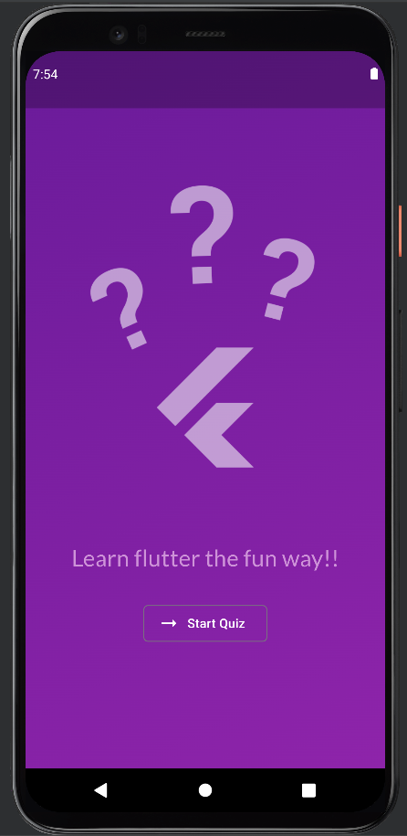
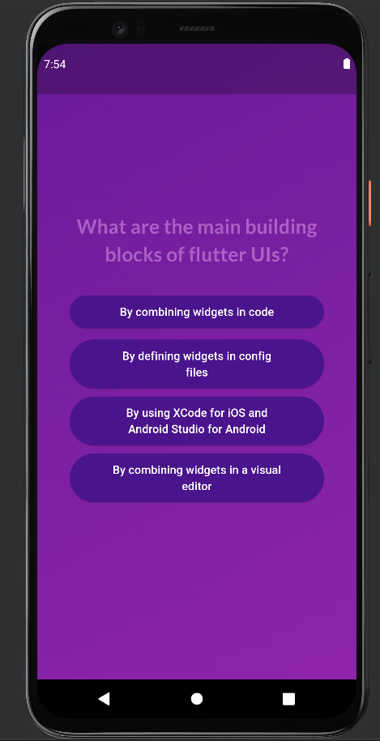
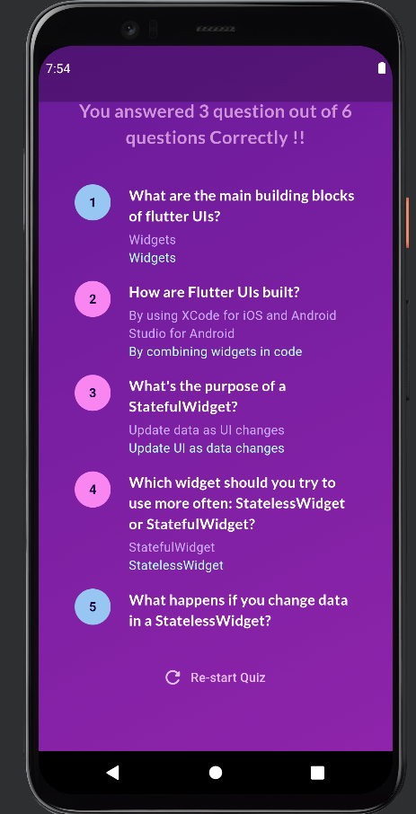

# 📚 Quiz App

A simple and interactive quiz application built with Flutter. This app allows users to answer a series of questions and see their results at the end. It's a great starting point for learning Flutter and building more complex applications.

## 🚀 Features

- 🌟 Start the quiz from a welcome screen
- 📝 Answer multiple-choice questions
- 📊 View results after completing the quiz
- 🔄 Restart the quiz to play again

## 📸 Screenshots

<p align="center">
  
  
  
</p>

## 🛠 Installation

To run this project on your local machine, follow these steps:

1. **Clone the repository:**

    ```sh
    git clone https://github.com/yourusername/quiz_app.git
    cd quiz_app
    ```

2. **Install Flutter and Dart:**

    Follow the official [Flutter installation guide](https://flutter.dev/docs/get-started/install) to set up Flutter on your machine.

3. **Install dependencies:**

    ```sh
    flutter pub get
    ```

4. **Run the app:**

    ```sh
    flutter run
    ```

## 📂 Project Structure

```plaintext
quiz_app/
├── lib/
│   ├── data/
│   │   └── questions.dart
│   ├── screens/
│   │   ├── start_screen.dart
│   │   ├── questions_screen.dart
│   │   └── result_screen.dart
│   ├── widgets/
│   │   ├── answer_button.dart
│   │   └── ...
│   ├── main.dart
│   └── quiz.dart
├── assets/
│   ├── images/
│   │   └── screenshots/
│   │       ├── start_screen.png
│   │       ├── question_screen.png
│   │       └── result_screen.png
├── test/
│   └── ...
├── pubspec.yaml
└── README.md
